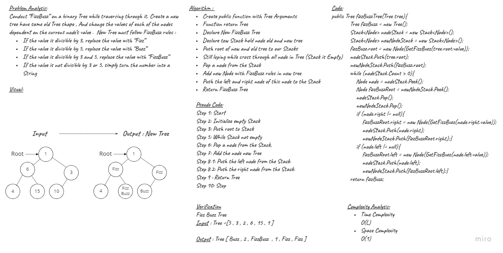
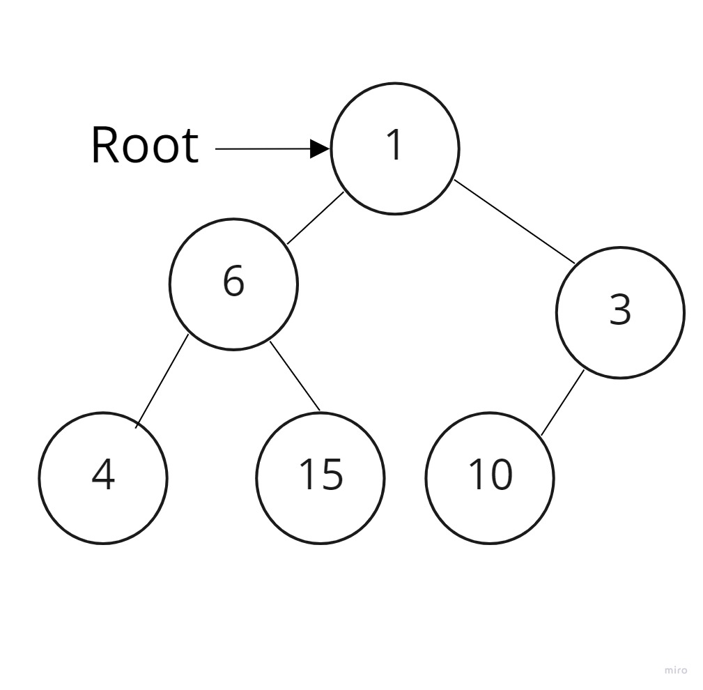
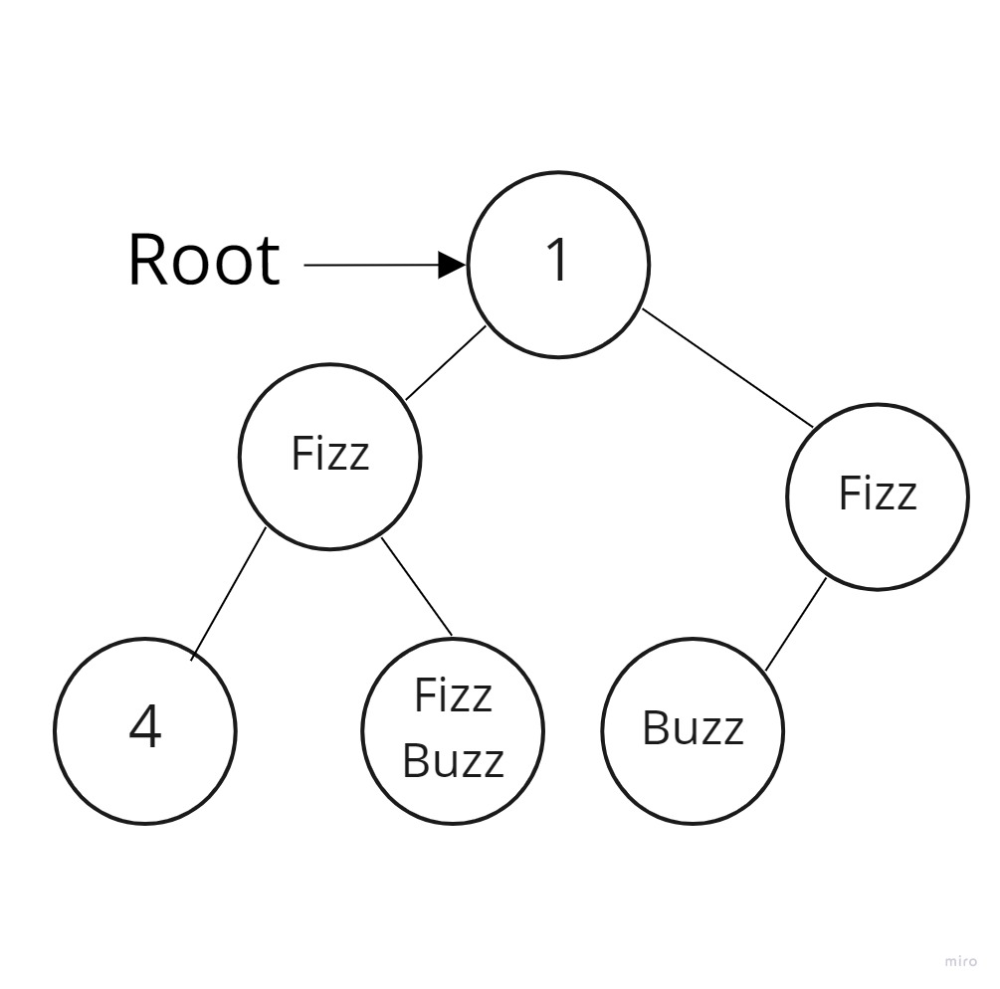

# Challenge Summary
<!-- Description of the challenge -->
**Fizz Buzz Tree Implementation**
Conduct “FizzBuzz” on a binary Tree while traversing through it. Create a new tree have same old Tree shape , And change the values of each of the nodes dependent on the current node’s value .  

New Tree must follow FizzBuzz rules :

- If the value is divisible by 3, replace the value with “Fizz”
- If the value is divisible by 5, replace the value with “Buzz”
- If the value is divisible by 3 and 5, replace the value with “FizzBuzz”
- If the value is not divisible by 3 or 5, simply turn the number into a String

## Approach & Efficiency
<!-- What approach did you take? Why? What is the Big O space/time for this approach? -->
| Method    | Time Complexity |Space Complexity|
|-----------|-----------------|----------------|
| Fizz Buzz | O(n)            | O(1)           |

## Whiteboard Process



## Solution
<!-- Show how to run your code, and examples of it in action -->
- Input Tree example :



- Output Tree : 



- fizzBuzzTree Function 

```C#
public Tree fizzBuzzTree(Tree tree)
        {
            Tree fizzBuzz = new Tree();

            Stack<Node> nodeStack = new Stack<Node>();

            Stack<Node> newNodeStack = new Stack<Node>();

            fizzBuzz.root = new Node(GetFizzBuzz(tree.root.value));

            nodeStack.Push(tree.root);
            newNodeStack.Push(fizzBuzz.root);

            while (nodeStack.Count > 0)
            {
                Node node = nodeStack.Peek();
                Node fizzBuzzRoot = newNodeStack.Peek();

                nodeStack.Pop();
                newNodeStack.Pop();

                if (node.right != null)
                {
                    fizzBuzzRoot.right = new Node(GetFizzBuzz(node.right.value));

                    nodeStack.Push(node.right);
                    newNodeStack.Push(fizzBuzzRoot.right);
                }
                if (node.left != null)
                {
                    fizzBuzzRoot.left = new Node(GetFizzBuzz(node.left.value));

                    nodeStack.Push(node.left);
                    newNodeStack.Push(fizzBuzzRoot.left);
                }
            }
            return fizzBuzz;
        }
```

- GetFizzBuzz fuction to check if value is divisible by 3 or 5 or both . 

```C#
private String GetFizzBuzz(object value)
        {
            if (Convert.ToInt32(value) % 3 == 0 && Convert.ToInt32(value) % 5 == 0)
            {
                return "FizzBuzz";
            }
            else if (Convert.ToInt32(value) % 5 == 0)
            {
                return "Buzz";
            }
            else if (Convert.ToInt32(value) % 3 == 0)
            {
                return "Fizz";
            }
            else
            {
                return $"{value}";
            }
        }
```

## Unit Tests

- [x] Test Fizz Buzz Tree if the value is divisible by 3, replace the value with Fizz
- [x] Test Fizz Buzz Tree if the value is divisible by 5, replace the value with Buzz
- [x] Test Fizz Buzz Tree if the value is divisible by 3 and 5, replace the value with FizzBuzz
- [x] Test Fizz Buzz Tree if the value is not divisible by 3 or 5, simply turn the number into a String.
- [x] Test if all node have Fizz Buzz rules .

1. Test Fizz Buzz Tree if the value is divisible by 3, replace the value with Fizz

```C#
        [Fact]
        public void Test1()
        {
            Tree tree = new Tree();
            tree.root = new Node(3);

            Tree fizzbuzz = tree.fizzBuzzTree(tree);

            Assert.Equal("Fizz", fizzbuzz.root.value );
        }
```

2. Test Fizz Buzz Tree if the value is divisible by 5, replace the value with Buzz

```C#
        [Fact]
        public void Test2()
        {
            Tree tree = new Tree();
            tree.root = new Node(5);

            Tree fizzbuzz = tree.fizzBuzzTree(tree);

            Assert.Equal("Buzz", fizzbuzz.root.value);
        }
```

3. Test Fizz Buzz Tree if the value is divisible by 3 and 5, replace the value with FizzBuzz

```C#
        [Fact]
        public void Test3()
        {
            Tree tree = new Tree();
            tree.root = new Node(15);

            Tree fizzbuzz = tree.fizzBuzzTree(tree);

            Assert.Equal("FizzBuzz", fizzbuzz.root.value);
        }
```

4. Test Fizz Buzz Tree if the value is not divisible by 3 or 5, simply turn the number into a String.

```C#
        [Fact]
        public void Test4()
        {
            Tree tree = new Tree();
            tree.root = new Node(1);

            Tree fizzbuzz = tree.fizzBuzzTree(tree);

            Assert.Equal("1", fizzbuzz.root.value);
        }
```

5. Test if all node have Fizz Buzz rules .

```C#
        [Fact]
        public void Test5()
        {
            Tree tree = new Tree();
            tree.root = new Node(5);
            tree.root.right = new Node(3);
            tree.root.left = new Node(2);
            tree.root.right.right = new Node(6);
            tree.root.left.left = new Node(15);
            tree.root.left.right = new Node(1);

            Tree fizzbuzz = tree.fizzBuzzTree(tree);

            List<string> list = new List<string> {"Buzz" ,"2" , "FizzBuzz", "1" ,"Fizz","Fizz"};


            Assert.Equal(list, fizzbuzz.TreeList());
        }
```

## Code Reference

[FizzBuzzTree](./FizzBuzzTree/FizzBuzzTree/)