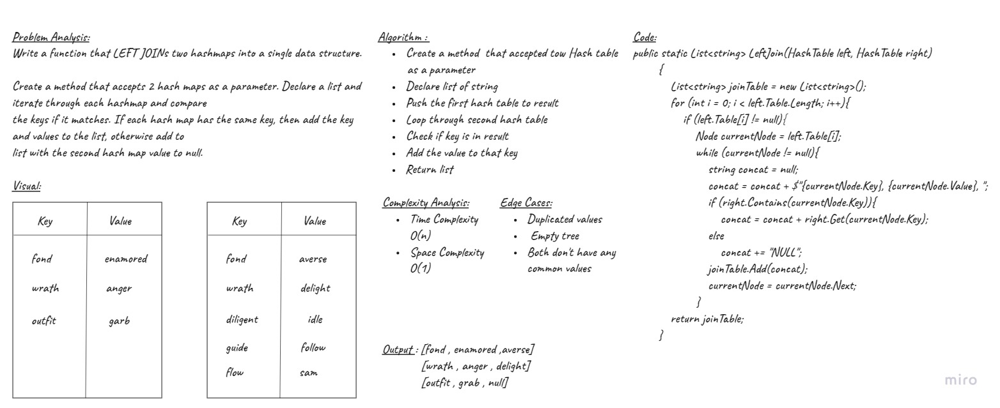

# Left Join
Implement a simplified LEFT JOIN for 2 Hashmaps.

## Challenge
Write a function that LEFT JOINs two hashmaps into a single data structure.

## Approach & Efficiency
Create a method that accepts 2 hash maps as a parameter. Declare a list and iterate through each hashmap and compare 
the keys if it matches. If each hash map has the same key, then add the key and values to the list, otherwise add to 
list with the second hash map value to null.

Time | Space
--- | ---
O(n) | O(1)

## Solution

***Test***
 
Write tests to prove the following functionality:

- [x] Test if ALL keys match
- [x] Test if Some keys match
- [x] Test with second empty hashmap

## Checklist
- [x] Top-level README “Table of Contents” is updated
- [x] Feature tasks for this challenge are completed
- [x] Unit tests written and passing
    - [x] “Happy Path” - Expected outcome
    - [x] Expected failure
    - [x] Edge Case (if applicable/obvious)
- [x] README for this challenge is complete
    - [x] Summary, Description, Approach & Efficiency, Solution
    - [x] Link to code
    - [x] Picture of whiteboard

## Code

[Code](./hashmap-left-join.cs)