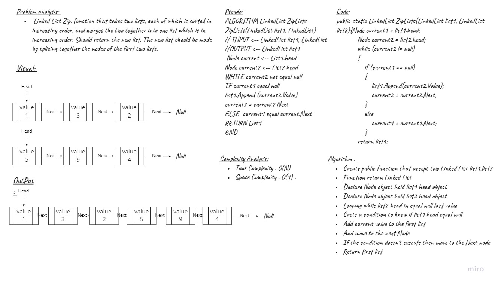

# Challenge Summary
<!-- Description of the challenge -->
 Linked List Zip: function that takes two lists, each of which is sorted in increasing order, and merges the two together into one list which is in increasing order. Should return the new list. The new list should be made by splicing together the nodes of the first two lists.
## Whiteboard Process
<!-- Embedded whiteboard image -->

## Approach & Efficiency
<!-- What approach did you take? Why? What is the Big O space/time for this approach? -->
| Method    | Time Complexity |Space Complexity|
|-----------|-----------------|----------------|
| ZipLists  | O(n)            | O(1)           |
## Solution
<!-- Show how to run your code, and examples of it in action -->
- ZipLists Function

```C#
public static LinkedList ZipLists(LinkedList list1, LinkedList list2)
        {
            LinkedList zipList = new LinkedList();
            Node current = list1.head;
            Node current2 = list2.head;
            while (current != null || current2 != null)
            {
                if (current != null)
                {
                    zipList.Append(current.Value);
                    current = current.Next;
                }
                if (current2 != null)
                {
                    zipList.Append(current2.Value);
                    current2 = current2.Next;
                }       
            }
            return zipList;
        }
```
- Append Function

```C#
public void Append(object value)
        {
            Node current = head;
            Node temp = new Node(value);
            if (current == null)
            {
                head = temp;
            }
            else
            {
                while (current.Next != null)
                {
                    current = current.Next;
                }
                current.Next = temp;
            }
        }
```

- Main fuction 

```C#
 static void Main(string[] args)
        {
          LinkedList list = new LinkedList();
            list.Append(1);
           list.Append(3);

          LinkedList list1 = new LinkedList();
            list1.Append(5);
            list1.Append(9);
            list1.Append(4);


            LinkedList list2 = LinkedList.ZipLists(list, list1);

            Node current = list2.head;

            while (current != null)
            {
                Console.WriteLine(current.Value);
                current = current.Next;
            }
        }
```

- Output

```bash
1
5
3
9
2
4

Press any key to close this window . . .
```

## Unit Tests

- Test if the next Node value have same Next node value for new zip list

```C#
[Fact]
        public void Test1()
        {
            LinkedList list = new LinkedList();
            list.Append(1);
            list.Append(3);
            list.Append(2);


            LinkedList list1 = new LinkedList();
            list1.Append(5);
            list1.Append(9);
            list1.Append(4);


            LinkedList list2 = new LinkedList();
            list2.Append(1);
            list2.Append(5);
            list2.Append(3);

            LinkedList zip = LinkedList.ZipLists(list, list1);

            Assert.Equal(zip.head.Next.Value,list2.head.Next.Value);
        }
```