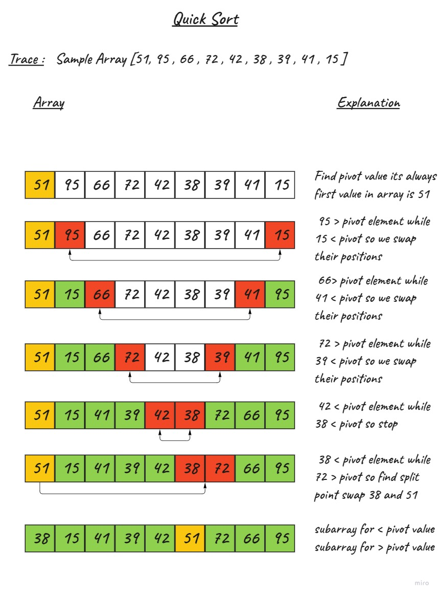

# Quick Sort

Quick Sort is a sorting algorithm that uses the divide and conquer method. It takes a pivot element and places it in its correct position. Then the array to the left and right of the pivot element are again sorted using Quick Sort. This is done until the whole array is sorted.

## Pseudocode

```bash
 ALGORITHM QuickSort(arr, left, right)
    if left < right
        // Partition the array by setting the position of the pivot value
        DEFINE position <-- Partition(arr, left, right)
        // Sort the left
        QuickSort(arr, left, position - 1)
        // Sort the right
        QuickSort(arr, position + 1, right)
```
```bash
ALGORITHM Partition(arr, left, right)
    // set a pivot value as a point of reference
    DEFINE pivot <-- arr[right]
    // create a variable to track the largest index of numbers lower than the defined pivot
    DEFINE low <-- left - 1
    for i <- left to right do
        if arr[i] <= pivot
            low++
            Swap(arr, i, low)

     // place the value of the pivot location in the middle.
     // all numbers smaller than the pivot are on the left, larger on the right.
     Swap(arr, right, low + 1)
    // return the pivot index point
     return low + 1
```
```bash
ALGORITHM Swap(arr, i, low)
    DEFINE temp;
    temp <-- arr[i]
    arr[i] <-- arr[low]
    arr[low] <-- temp
```

## Trace

Sample Array: [51, 95, 66, 72, 42, 38, 39, 41, 15]

- First Partition Level

    We start traversing the array from the left and right indexes while comparing their elements against the pivot. 95 is greater than the pivot while 15 is less than the pivot so we swap their positions and the array becomes:



- Second Partition Level
    The left subarray is 38, 15, 41, 39, 42 and the right subarray is 72, 66, 95

.jpg)

## Efficency

- Time Complexity 
    
    - The Worst case occurs when the pivot element is either greatest or smallest element. Suppose, if the pivot element is always the last element of the array, the worst case would occur when the given array is sorted already in ascending or descending order. The worst-case time complexity of quicksort is O(n2).

- Space

    - Since the array is sorted in place and no extra space is used, the space complexity is O(1)

## Testing 

[Test](./QuickSort/QuickSortTest/UnitTest1.cs)

## Code reference

[Code](./QuickSort/QuickSort/Program.cs)