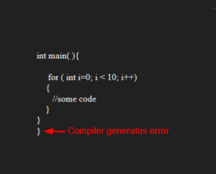

# Challenge Summary
<!-- Description of the challenge -->
Given an expression containing different open and close parentheses, Whether the expression has balanced parentheses or not. The expression can contain the following parentheses →’(’, ‘)’, ‘{‘, ‘}’, ‘[‘, ‘]’. The expression is said to be balanced if :
- The order of the opening and closing brackets is same.
- The opening bracket must be closed with the same type of closing bracket.

We will use a stack data structure to evaluate an expression. Stack is a LIFO based data structure with only one entry and exit point. When we will encounter an opening bracket we will push it into the stack and when we will encounter the closing bracket, we will compare the top element. If the top element is not a corresponding opening bracket, we will return False else we will pop the corresponding top opening bracket. For example, the given expression is “[{()}]”.

- Checking for balanced parentheses is one of the most important task of a compiler.


## Whiteboard Process
<!-- Embedded whiteboard image -->

## Approach & Efficiency
<!-- What approach did you take? Why? What is the Big O space/time for this approach? -->
| Time Complexity |Space Complexity|
|-----------------|----------------|
| O(n)            | O(n)           |

## Solution
<!-- Show how to run your code, and examples of it in action -->
- ValidateBrackets fuction

```C#
public static bool ValidateBrackets(string str)
        {
            Stack<char> bracketStack = new Stack<char>();
            for (int i = 0; i < str.Length; i++)
            {
                if (str[i] == '(' || str[i] == '[' || str[i] == '{')
                {
                    bracketStack.Push(str[i]);
                    continue;
                }else if(str[i] == ')' || str[i] == ']' || str[i] == '}')
                {
                    if (bracketStack.Count == 0)
                    {
                        return false;
                    }
                    else
                    {
                        if (str[i] == ')' && bracketStack.Peek() == '(')
                        {
                            bracketStack.Pop();
                            continue;
                        }
                        else if (str[i] == ']' && bracketStack.Peek() == '[')
                        {
                            bracketStack.Pop();
                            continue;
                        }
                        else if (str[i] == '}' && bracketStack.Peek() == '{')
                        {
                            bracketStack.Pop();
                            continue;
                        }
                        else
                        {
                            return false;
                        }
                    }
                }
            }
            //Check if Stack not empty or string empty
            if (bracketStack.Count > 0 || str == "")
            {
                return false;
            }else
                return true;
        }
```


## Unit Tests

- [x] Test all true ways.
- [x] Test all false ways.


1. Test all true ways.

```C#
      [Theory]
        [InlineData("{}")]
        [InlineData("{}(){}")]
        [InlineData("()[[Extra Characters]]")]
        [InlineData("(){}[[]]")]
        [InlineData("{}{Code}[Fellows](())")]
        public void Test1(string inputString)
        {
            Assert.True(Program.ValidateBrackets(inputString));
        }
```

2. Test all false ways.

```C#
        [Theory]
        [InlineData("[({}]")]
        [InlineData("(](")]
        [InlineData("{(})")]
        [InlineData("(")]
        [InlineData("{}{Code}[Fellows](()){)")]
        [InlineData("")]
        public void Test2(string inputString)
        {
            Assert.False(Program.ValidateBrackets(inputString));
        }
```

## Code Reference

[Stack-Queue-Brackets](./Stack-queue-brackets/Stack-queue-brackets/)