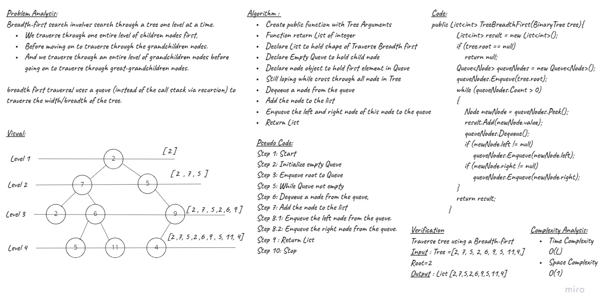
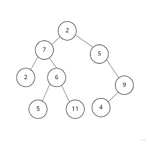

# Challenge Summary
<!-- Description of the challenge -->
**Traverse Tree using a Breadth-first approach**

Breadth-first search involves search through a tree one level at a time.
- We traverse through one entire level of children nodes first, 
- Before moving on to traverse through the grandchildren nodes. 
- And we traverse through an entire level of grandchildren nodes 
- Before going on to traverse through great-grandchildren nodes.

breadth first traversal uses a queue (instead of the call stack via recursion) to traverse the width/breadth of the tree.

## Approach & Efficiency
<!-- What approach did you take? Why? What is the Big O space/time for this approach? -->
| Method    | Time Complexity |Space Complexity|
|-----------|-----------------|----------------|
| Breadth-first       | O(n)  | O(1)           |

## Whiteboard Process



## Solution
<!-- Show how to run your code, and examples of it in action -->
- Tree example 



- TreeBreadthFirst Function 

```C#
public List<int> TreeBreadthFirst(BinaryTree tree)
        {
            List<int> result = new List<int>();

            if (tree.root == null)
            {
                return null;
            }

            Queue<Node> queueNodes = new Queue<Node>();

            queueNodes.Enqueue(tree.root);

            while (queueNodes.Count > 0)
            {
                Node newNode = queueNodes.Peek();

                result.Add(newNode.value);

                queueNodes.Dequeue();

                if (newNode.left != null)
                {
                    queueNodes.Enqueue(newNode.left);
                }
                if (newNode.right != null)
                {
                    queueNodes.Enqueue(newNode.right);
                }
            }

            return result;
        }
```

## Unit Tests

- [x] Test to Traverse the input tree using a Breadth-first approach , We will add node as this following tree


1. Test TreeBreadthFirst function 

```C#
        [Fact]
        public void Test9()
        {
            BinaryTree tree = new BinaryTree();
            tree.root = new Node(2);
            tree.root.left = new Node(7);
            tree.root.right = new Node(5);
            tree.root.left.left = new Node(2);
            tree.root.left.right = new Node(6);
            tree.root.left.right.left = new Node(5);
            tree.root.left.right.right = new Node(11);
            tree.root.right.right = new Node(9);
            tree.root.right.right.left = new Node(4);

            List<int> result = new List<int>() { 2, 7, 5, 2, 6, 9, 5, 11, 4 };

            Assert.Equal(result, tree.TreeBreadthFirst(tree));
        }
```
- Output = [2,7,5,2,6,9,5,11,4]

## Code Reference

[TreeBreadthFirst](./Trees/Trees/)