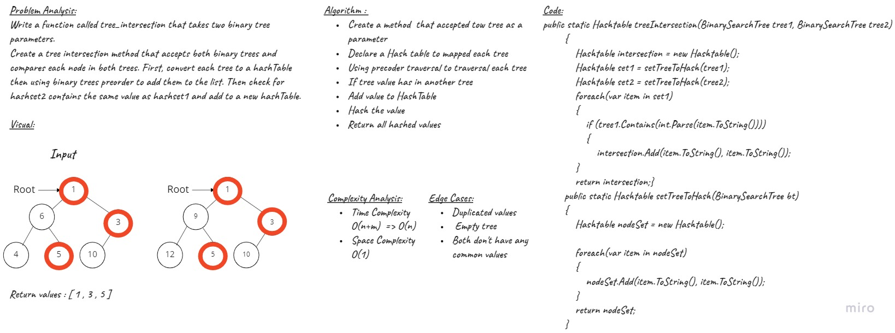

# Tree Intersection

## Challenge
Write a function called tree_intersection that takes two binary tree parameters.

## Approach & Efficiency
Create a tree intersection method that accepts both binary trees and compares each node in both trees.
First, convert each tree to a hashset then using binary trees preorder to add them to the list.
Then check for hashset2 contains the same value as hashset1 and add to a new hashset.

Time | Space
---  | ---
O(m+n) | O(n)

## Solution

## Features
 
***Test***
- [x] Test All common nodes in both trees
- [x] Test some common nodes in both trees
- [x] Test an empty tree
 
## Checklist
- [x] Top-level README “Table of Contents” is updated
- [x] Feature tasks for this challenge are completed
- [x] Unit tests written and passing
    - [x] “Happy Path” - Expected outcome
    - [x] Expected failure
    - [x] Edge Case (if applicable/obvious)
- [x] README for this challenge is complete
    - [x] Summary, Description, Approach & Efficiency, Solution
    - [x] Link to code
    - [x] Picture of whiteboard

## Code

[Code](./Tree-Intersection/Tree-Intersection/TreeIntersection.cs)