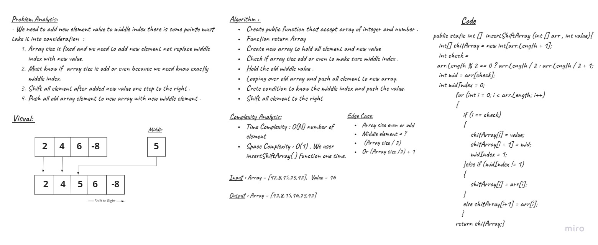

# Insert to Middle of an Array
<!-- Description of the challenge -->
- Challenge is how to input array and new value , And push this new value to middle index , Finally return array have all old element and new element in middle and shift all element after middle to the right .
## Whiteboard Process
<!-- Embedded whiteboard image -->

## Approach & Efficiency
<!-- What approach did you take? Discuss Why. What is the Big O space/time for this approach? -->
- Shifting all element after middle to the right and push the new value in the middle
- Time Complexity O(N)  N number of element (Array size) .
- Space Complexity : O(1)  because we use a insertShiftArray ( ) function one time in main .