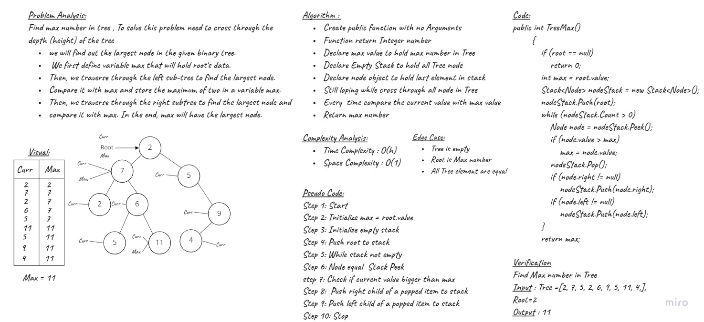
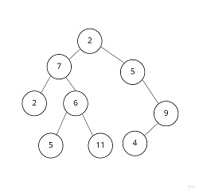

# Challenge Summary
<!-- Description of the challenge -->
**Find Max number in Tree**
Find max number in tree , To solve this problem need to cross through the depth (height) of the tree
- We will find out the largest node in the given binary tree.
- We first define variable max that will hold root's data. 
- Then, we traverse through the left sub-tree to find the largest node.
- Compare it with max and store the maximum of two in a variable max. 
- Then, we traverse through the right subtree to find the largest node and 
- Compare it with max. In the end, max will have the largest node.

## Approach & Efficiency
<!-- What approach did you take? Why? What is the Big O space/time for this approach? -->
| Method    | Time Complexity |Space Complexity|
|-----------|-----------------|----------------|
| Max       | O(h)            | O(1)           |

## Whiteboard Process



## Solution
<!-- Show how to run your code, and examples of it in action -->
- Tree example 



- TreeMax Function

```C#
public int TreeMax()
        {
            if (root == null)
            {
                return 0;
            }

            int max = root.value;

            Stack<Node> nodeStack = new Stack<Node>();

            nodeStack.Push(root);

            while (nodeStack.Count > 0)
            {
                Node node = nodeStack.Peek();

                if (node.value > max)
                {
                    max = node.value;
                }
                nodeStack.Pop();

                if (node.right != null)
                {
                    nodeStack.Push(node.right);
                }
                if (node.left != null)
                {
                    nodeStack.Push(node.left);
                }
            }

            return max;
        }
```

## Unit Tests

- [x] Test find max function , We will add node as this following tree


1. Test TreeMax function 

```C#
        [Fact]
        public void Test8()
        {
            BinaryTree tree = new BinaryTree();
            tree.root = new Node(2);
            tree.root.left = new Node(7);
            tree.root.right = new Node(5);
            tree.root.left.left = new Node(2);
            tree.root.left.right = new Node(6);
            tree.root.left.right.left = new Node(5);
            tree.root.left.right.right = new Node(11);
            tree.root.right.right = new Node(9);
            tree.root.right.right.left = new Node(4);

            Assert.Equal(11, tree.TreeMax());
        }
```
- Output = 11

## Code Reference

[TreeMax](./Trees/Trees/)