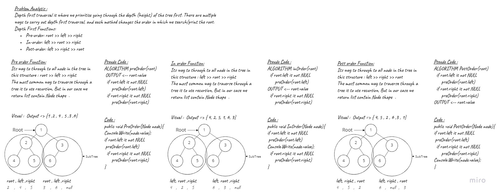

# Challenge Summary
<!-- Description of the challenge -->
An important aspect of trees is how to traverse them. Traversing a tree allows us to search for a node, print out the contents of a tree, and much more! There are two categories of traversals when it comes to trees:
- Depth First

**Depth First**

Depth first traversal is where we prioritize going through the depth (height) of the tree first. There are multiple ways to carry out depth first traversal, and each method changes the order in which we search/print the root. Here are three methods for depth first traversal:

- Pre-order: root >> left >> right
- In-order: left >> root >> right
- Post-order: left >> right >> root

**Add Node to binary search tree**
You are given the root node of a binary search tree (BST) and a value to insert into the tree. Return the root node of the BST after the insertion. It is guaranteed that the new value does not exist in the original BST.

**Search in binary search tree**
Binary Search Tree is a node-based binary tree data structure which has the following properties:

- The left subtree of a node contains only nodes with keys lesser than the node’s key.
- The right subtree of a node contains only nodes with keys greater than the node’s key.
- The left and right subtree each must also be a binary search tree. 
- There must be no duplicate nodes.

## Approach & Efficiency
<!-- What approach did you take? Why? What is the Big O space/time for this approach? -->
| Method    | Time Complexity |Space Complexity|
|-----------|-----------------|----------------|
| Contains  | O(log n)         | O(1)          |
|  Add      | O(height)        | O(1)          |

## Whiteboard Process



## Solution
<!-- Show how to run your code, and examples of it in action -->
- Node Class

```C#
public Node left { get; set; }
        public Node right { get; set; }

        public int value { get; set; }

        public Node(int value)
        {
            this.value = value;
            left = right = null;
        }
```
- Insert Function

```C#
public void Add(int value)
        {
            Node before = null;
            
            Node after = this.root;

            while (after != null)
            {
                before = after;
                if (value < after.value) 
                    after = after.left;
                else if (value > after.value)
                    after = after.right;
            }

            Node newNode = new Node(value);

            if (this.root == null)
                this.root = newNode;
            else
            {
                if (value < before.value)
                    before.left = newNode;
                else
                    before.right = newNode;
            }
        }
```

- Contains Function

```C#
public bool Contains(int value)
        {
            if (root == null)
            {
                return false;
            }

            Node current = root;

            while (current != null)
            {
                if (current.value == value)
                {
                    return true;
                }
                else if(value < current.value)
                {
                    current = current.left;
                }
                else if(value > current.value)
                    current = current.right;
            }

            return false;
        }
```

## Unit Tests

- [x] Can successfully instantiate an empty tree
- [x] Can successfully instantiate a tree with a single root node
- [x] For a Binary Search Tree, can successfully add a left child and right child properly to a node
- [x] Can successfully return a collection from a preorder traversal
- [x] Can successfully return a collection from an inorder traversal

1. Can successfully instantiate an empty tree

```C#
        [Fact]
        public void Test1()
        {
            BinaryTree tree = new BinaryTree();

            Assert.Null(tree.root);
        }
```

2. Can successfully instantiate a tree with a single root node

```C#
       [Fact]
        public void Test2()
        {
            BinaryTree tree = new BinaryTree();
            Node node = new Node(40);
            tree.root = node;
            Assert.Null(tree.root.right);
        }
```

3. Can successfully add a left child and right child properly to a node

```C#
        [Fact]
        public void Test3()
        {
            BinarySearchTree binaryTree = new BinarySearchTree();
            binaryTree.root = new Node(60);
            binaryTree.root.left = new Node(20);
            binaryTree.root.right = new Node(80);
            Assert.Equal(20,binaryTree.root.left.value);
        }
```

4. Return true for the contains method, given an existing node value

```C#
        [Fact]
        public void Test4()
        {
            BinarySearchTree binaryTree = new BinarySearchTree();
            binaryTree.Add(50);
            binaryTree.Add(20);
            binaryTree.Add(90);
            binaryTree.Add(18);
            Assert.True(binaryTree.Contains(18));
        }
```

5. Return false for the contains method, given an non-existing node value

```C#
        [Fact]
        public void Test5()
        {
            BinarySearchTree binaryTree = new BinarySearchTree();
            binaryTree.Add(50);
            binaryTree.Add(20);
            binaryTree.Add(90);
            binaryTree.Add(18);
            Assert.False(binaryTree.Contains(100));
        }
```

6. Can successfully return a collection from a preorder traversal

```C#
        [Fact]
        public void Test6()
        {
            BinarySearchTree binaryTree = new BinarySearchTree();
            binaryTree.Add(50);
            binaryTree.Add(20);
            binaryTree.Add(90);
            binaryTree.Add(18);

            List<int> result = new List<int>() {50,20,18,90};

            Assert.Equal(result, binaryTree.PreOrder(binaryTree.root));
        }
```

7. Can successfully return a collection from an inorder traversal

```C#
        [Fact]
        public void Test7()
        {
            BinarySearchTree binaryTree = new BinarySearchTree();
            binaryTree.Add(50);
            binaryTree.Add(20);
            binaryTree.Add(90);
            binaryTree.Add(18);

            List<int> result = new List<int>() { 18,20,50,90 };

            Assert.Equal(result, binaryTree.InOrder(binaryTree.root));
        }
```
## Code Reference

[BinaryTree](./Trees/Trees/)