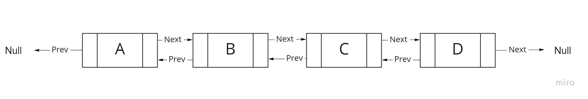
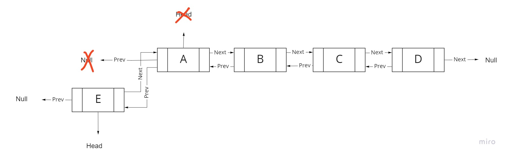

## Challenge
<!-- Description of the challenge -->
- Doubly Linked List : contains an extra pointer, typically called previous pointer, together with next pointer and data which are there in singly linked list.
- Every node in Doubly Linked list have Prev and value and next.

### How Doubly Linked List look like

## Approach & Efficiency
<!-- What approach did you take? Why? What is the Big O space/time for this approach? -->

| Method    | Time Complexity |
|-----------|-----------------|
| Insertion | O(1)            |
| Search    | O(n)            |
| Deletion  | O(1)            |

Space Complexity : O(n)
## API
<!-- Description of each method publicly available to your Linked List -->
### Doubly Linked List methods

- Insertion : The new node is always added before the head

- AddEnd: Inserting an element at the end of the list.

- Remove: Removing given element from the list.

- AddBefore:  Inserting before given element.

- AddAfter: Inserting after given element.

- Include : Search into linked list for specific value.