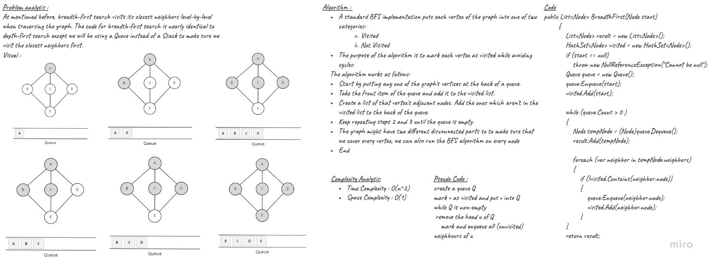

# Depth First Traversal

## Challenge
Traversal means visiting all the nodes of a graph. Breadth First Traversal or Breadth First Search is a recursive algorithm for searching all the vertices of a graph or tree data structure.

## Approach & Efficiency

Time | Space
--- | ---
O(v+E) | O(v)

## Solution



## Code


```C#
public List<Node> BreadthFirst(Node start)
        {
            List<Node> result = new List<Node>();
            HashSet<Node> visited = new HashSet<Node>();

            if (start == null)
            {
                throw new NullReferenceException("Cannot be null");
            }

            Queue queue = new Queue();
            queue.Enqueue(start);
            visited.Add(start);

            while (queue.Count > 0 )
            {
                Node tempNode = (Node)queue.Dequeue();
                result.Add(tempNode);

                foreach (var neighbor in tempNode.neighbors)
                {
                    if (!visited.Contains(neighbor.node))
                    {
                        queue.Enqueue(neighbor.node);
                        visited.Add(neighbor.node);
                    }
                }
            }
            return result;
        }
```

## Tests

```C#
        [Fact]
        public void test_bfs()
        {
            Graphs graph = new Graphs();
            Node one = graph.addNode(1);
            Node two = graph.addNode(2);
            Node three = graph.addNode(2);

            one.addNeighbor(two);
            one.addNeighbor(three);

            List<Node> expected = new List<Node>();
            expected.Add(one);
            expected.Add(three);
            expected.Add(two);

            Assert.Equal(expected, graph.Depthfirst(one));
        }
```

