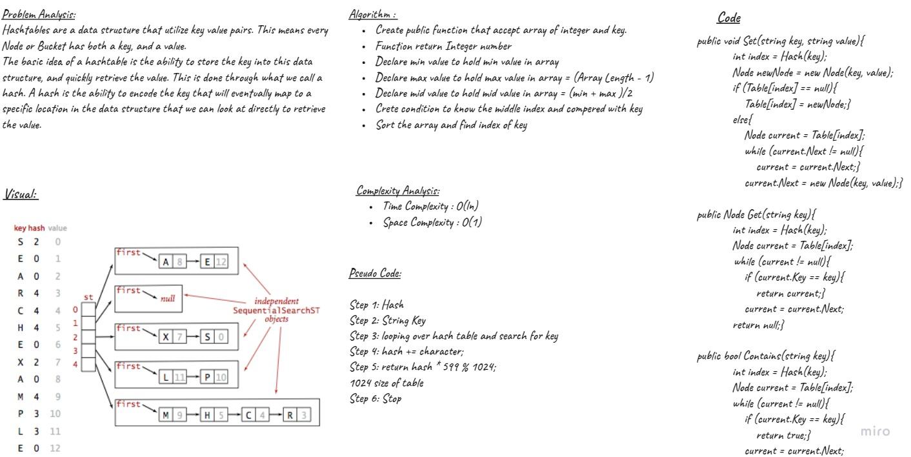

# Challenge Summary
<!-- Description of the challenge -->
## Hash Table

Hashtables are a data structure that utilize key value pairs. This means every Node or Bucket has both a key, and a value.
The basic idea of a hashtable is the ability to store the key into this data structure, and quickly retrieve the value. This is done through what we call a hash. A hash is the ability to encode the key that will eventually map to a specific location in the data structure that we can look at directly to retrieve the value.

## Approach & Efficiency
<!-- What approach did you take? Why? What is the Big O space/time for this approach? -->
| Method    | Time Complexity |Space Complexity|
|-----------|-----------------|----------------|
| Contains  | O(n)            | O(1)           |
| Set       | O(n)            | O(1)           |
| get       | O(n)            | O(1)           |

## Whiteboard Process



## Solution
<!-- Show how to run your code, and examples of it in action -->
- Node Class

```C#
public class Node
    {
        public string Key { get; set; }
        public string Value { get; set; }
        public Node Next { get; set; }

        public Node(string key, string value)
        {
            Key = key;
            Value = value;
        }
    }
```
- Set Function

```C#
public void Set(string key, string value)
        {
            int index = Hash(key);
            Node newNode = new Node(key, value);

            if (Table[index] == null)
            {
                Table[index] = newNode;
            }
            else
            {
                Node current = Table[index];
                while (current.Next != null)
                {
                    current = current.Next;
                }
                current.Next = new Node(key, value);
            }
        }

```

- Get Function

```C#
public Node Get(string key)
        {
            int index = Hash(key);
            Node current = Table[index];

            while (current != null)
            {
                if (current.Key == key)
                {
                    return current;
                }
                current = current.Next;
            }

            return null;
        }
```

- Contains Function

```C#
public bool Contains(string key)
        {
            int index = Hash(key);
            Node current = Table[index];

            while (current != null)
            {
                if (current.Key == key)
                {
                    return true;
                }
                current = current.Next;
            }

            return false;
        }
```

- Hash Function 

```C#
public int Hash(string key)
        {
            int hash = 0;

            foreach (int character in key)
            {
                hash += character;
            }

            return hash * 599 % 1024;
        }
```

## Unit Tests

- [x] Setting a key/value to hashtable
- [x] Retrieving based on a key returns the value stored
- [x] Successfully returns null for a key that does not exist in the hashtable

1. Setting a key/value to hashtable 

```C#
        MyHashTable hashTable = new MyHashTable(1024);
        
        [Fact]
        public void Test1()
        {
            hashTable.Set("1", "Cat");
            hashTable.Set("2", "Dog");
            hashTable.Set("3", "Fish");

            Assert.Equal("Cat",hashTable.Get("1").Value);
        }
```

2. Retrieving based on a key returns the value stored

```C#
        [Fact]
        public void Test2()
        {
            hashTable.Set("1", "Cat");
            hashTable.Set("2", "Dog");
            Assert.True(hashTable.Contains("2"));
        }
```

3. Successfully returns null for a key that does not exist in the hashtable

```C#
        [Fact]
        public void Test3()
        {
            MyHashTable hashTable1 = new MyHashTable(1024);
            Assert.Null(hashTable1.Get("3"));
        }
```

## Code Reference

[Hash Table](./HashTable/HashTable/MyHashTable.cs)