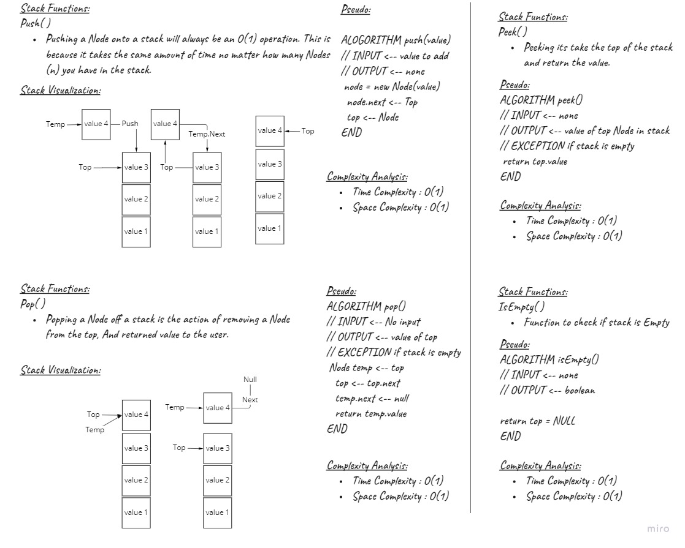
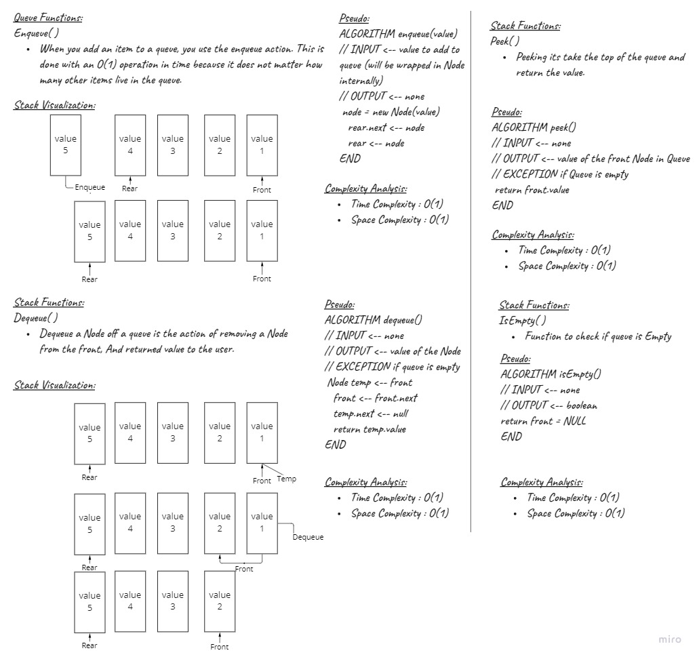

# Stacks and Queues
<!-- Short summary or background information -->
**Stack** : Is a linear data structure which follows a particular order in which the operations are performed. The order may be LIFO(Last In First Out) or FILO(First In Last Out).

**Queue** : Is an abstract data structure, somewhat similar to Stacks. Unlike stacks, a queue is open at both its ends. One end is always used to insert data (enqueue) and the other is used to remove data (dequeue). Queue follows First-In-First-Out methodology, i.e., the data item stored first will be accessed first.

## Challenge
<!-- Description of the challenge -->
**Stack whiteboard**


**Queue whiteboard**

## Approach & Efficiency
<!-- What approach did you take? Why? What is the Big O space/time for this approach? -->
**Stack Methods**
| Method    | Time Complexity |Space Complexity|
|-----------|-----------------|----------------|
| Push      | O(1)            | O(1)           |
| Pop       | O(1)            | O(1)           |
| Peek      | O(1)            | O(1)           |
| IsEmpty   | O(1)            | O(1)           |

**Queue Methods**
| Method    | Time Complexity |Space Complexity|
|-----------|-----------------|----------------|
| Enqueue   | O(1)            | O(1)           |
| Dequeue   | O(1)            | O(1)           |
| Peek      | O(1)            | O(1)           |
| IsEmpty   | O(1)            | O(1)           |
## API
<!-- Description of each method publicly available to your Stack and Queue-->
**Stack Functions**
- Push() : Pushing a Node onto a stack will always be an O(1) operation. This is because it takes the same amount of time no matter how many Nodes (n) you have in the stack.

```C#
public void Push(object value)
        {
            Node temp = new Node();
            temp.Value = value;

            if (IsEmpty())
            {
                top = temp;
            }
            else
            {
                temp.Next = top;
                top = temp;
            }   
        }
```
- Pop() : Popping a Node off a stack is the action of removing a Node from the top, And returned value to the user.
```C#
        public object Pop()
        {
            try
            {
                Node temp = top;
                top = top.Next;
                temp.Next = null;
                return temp.Value;
            }
            catch(NullReferenceException e)
            {
                return null;
            }
            
        }
```

- Peek() : Peeking its take the top of the stack  and return the value.

```C#
public object Peek()
        {
            try
            {
                return top.Value;
            }
            catch (NullReferenceException )
            {
                return null;
            }
        }
```

- IsEmpty() : Function to check if stack is Empty

```C#
        public bool IsEmpty()
        {
            return top == null;
        }
```

**Queue Functions**

- Enqueue(): When you add an item to a queue, you use the enqueue action. This is done with an O(1) operation in time because it does not matter how many other items live in the queue.
```C#
public void Enqueue(object value)
        {
            Node temp = new Node();
            temp.Value = value;
            if (IsEmpty())
            {
                front = temp;
                rear = temp;
            }
            else
            {
                rear.Next = temp;
                rear = temp;
            }
        }
```
- Dequeue() : Dequeue a Node off a queue is the action of removing a Node from the front, And returned value to the user.

```C#
public object Dequeue()
        {
            try { 
            Node temp = new Node();
            temp = front;
            front = front.Next;
            temp.Next = null;
            return temp.Value;
            }
            catch (NullReferenceException e)
            {
                return null;
            }
        }
```

- Peek(): Peeking its take the top of the queue and return the value.
```C#
public object Peek()
        {
            try
            {
                return front.Value;
            }
            catch (NullReferenceException)
            {
                return null;
            }
        }
```

- IsEmpty(): Function to check if queue is Empty.

```C#
        public bool IsEmpty()
        {
            return this.front == null;
        }
```
## Unit Tests For Stack

- [x] Test instantiate an empty linked list
- [x] Test for insert into the linked list
- [x] Test the head property will properly point to the first node in the linked list
- [x] Tset if can properly insert multiple nodes into the linked list
- [x] Test to return true when finding a value within the linked list that exists
- [x] Test to return false when searching for a value in the linked list that does not exist
- [x] Test to return a collection of all the values that exist in the linked list

## Unit Tests For Queue

- [x] Test to enqueue into a queue
- [x] Test to enqueue multiple values into a queue
- [x] Test to dequeue out of a queue the expected value
- [x] Test to peek into a queue
- [x] Test empty a queue after multiple dequeues
- [x] Test to instantiate an empty queue
- [x] Test to dequeue or peek on empty queue raises exception

## Code Reference

[Stack Project](./Stack-Queue/Stack-Queue/Stack.cs)

[Queue Project](./Stack-Queue/Stack-Queue/Queue.cs)