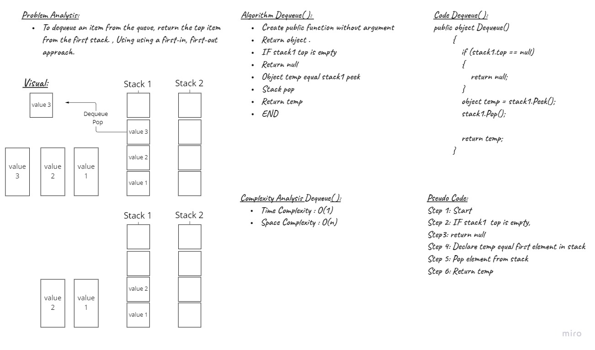
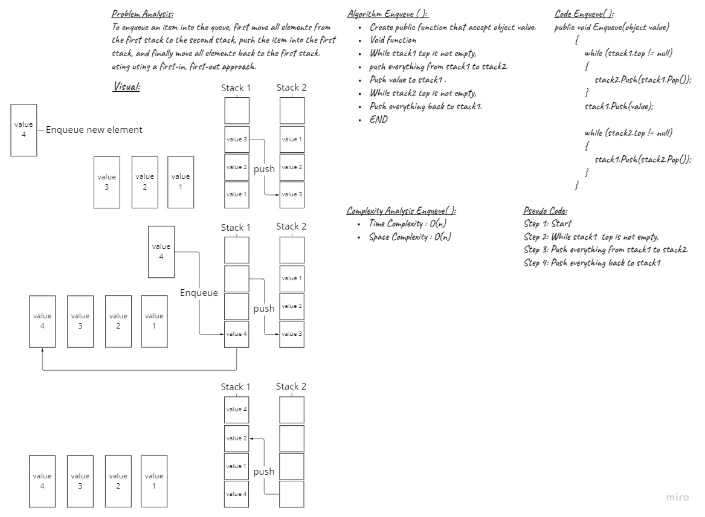

# Challenge Summary
<!-- Description of the challenge -->
To enqueue an item into the queue, first move all elements from the first stack to the second stack, push the item into the first stack, and finally move all elements back to the first stack.
using using a first-in, first-out approach.
To dequeue an item from the queue, return the top item from the first stack , Using using a first-in, first-out approach.
## Whiteboard Process
<!-- Embedded whiteboard image -->

## Approach & Efficiency
<!-- What approach did you take? Why? What is the Big O space/time for this approach? -->
| Method    | Time Complexity |Space Complexity|
|-----------|-----------------|----------------|
| Enqueue  | O(n)            | O(1)           |
| Dequeue  | O(1)            | O(1)           |

## Whiteboard Process





## Solution
<!-- Show how to run your code, and examples of it in action -->
- Enqueue Function

```C#
public void Enqueue(object value)
        {
            while (stack1.top != null)
            {
                stack2.Push(stack1.Pop());
            }
            stack1.Push(value);

            while (stack2.top != null)
            {
                stack1.Push(stack2.Pop());
            }
        }
```
- Dequeue Function

```C#
public object Dequeue()
        {
            if (stack1.top == null)
            {
                return null;
            }

            // Return top of s1
            object temp = stack1.Peek();
            stack1.Pop();

            return temp;
        }
```

## Unit Tests

- [x] Test to add new element to empty pseudo queue
- [x] Test to add multiple elements to pseudo queue using(FIFO) approach
- [x] Test to create empty pseudo queue

1. Test to add new element to empty pseudo queue

```C#
        [Fact]
        public void Test1()
        {
            PseudoQueue queue = new PseudoQueue();
            queue.Enqueue(1);

            Assert.Equal(1, queue.Dequeue());
        }
```

2. Test to add multiple elements to pseudo queue using(FIFO) approach

```C#
        [Fact]
        public void Test2()
        {
            PseudoQueue queue = new PseudoQueue();
            queue.Enqueue(1);
            queue.Enqueue(2);
            queue.Enqueue(3);

            Assert.Equal(1, queue.Dequeue());
        }
```

3. Test to create empty pseudo queue

```C#
        [Fact]
        public void Test3()
        {
            PseudoQueue queue = new PseudoQueue();

            Assert.Null(queue.Dequeue());
        }
```

## Code Reference

[stack-queue-pseudo](./stack-queue-pseudo/stack-queue-pseudo/)