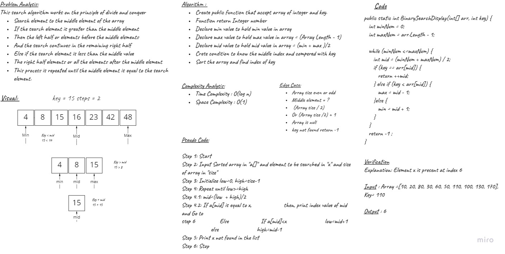

# Binary Search of Sorted Array
<!-- Description of the challenge -->
- Binary search work with sort array to find how many steps  need to find the number , Its basically work to divide the array and comber if mid lees or more than number if lees its take left array from mid and repeat this steps tell mid number equal the number
## Whiteboard Process
<!-- Embedded whiteboard image -->

## Approach & Efficiency
<!-- What approach did you take? Discuss Why. What is the Big O space/time for this approach? -->
- Divide array to left and right and compare if mid lees or more than key.
- Time Complexity : O(log n) 
- Space Complexity : O(1) 