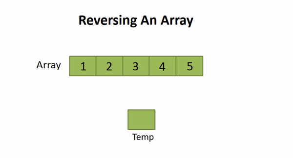

# Reverse an Array
<!-- Description of the challenge -->
- We need to change array element For ex: the first element should come last index and last index become first index and second element in (last element -1), And element before last came in (first element + 1) this way we don't need to change mid element index .

## Whiteboard Process
<!-- Embedded whiteboard image -->

## Approach & Efficiency
<!-- What approach did you take? Discuss Why. What is the Big O space/time for this approach? -->
- To reverse an array, we will use the concept of switching. switching is swapping between two values at different locations with each other.
- Time Complexity O(N)  N number of element  .
- Space Complexity : O(1)  because we use a reverseArray () function one time in main .

- example to get a clear understanding :

