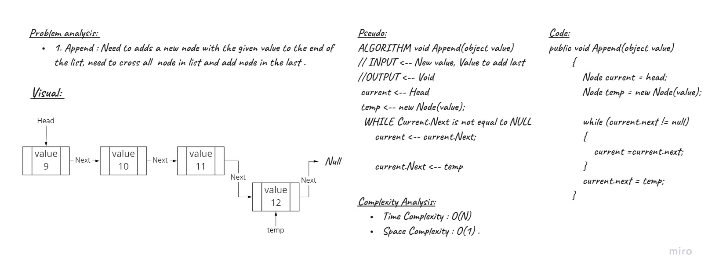
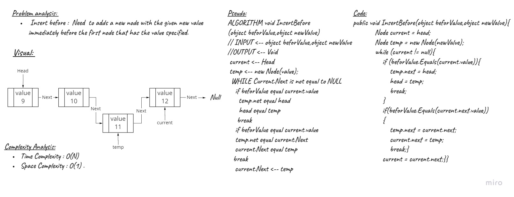
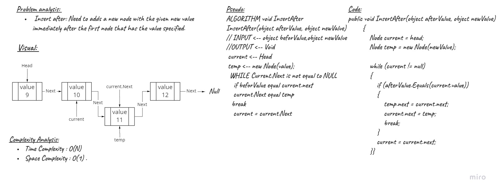

# Challenge Summary
<!-- Description of the challenge -->
- We need to Implement  some of common  function to singly linked list :
    1. Append : Need to adds a new node with the given value to the end of the list, need to cross all  node in list and add node in the last .
    2. Insert before :  Need  to adds a new node with the given new value immediately before the first node that has the value specified.
    3. Insert after: Need to adds a new node with the given new value immediately after the first node that has the value specified.

## Whiteboard Process
<!-- Embedded whiteboard image -->
Append

Insert before

Insert after

## Approach & Efficiency
<!-- What approach did you take? Why? What is the Big O space/time for this approach? -->
| Method    | Time Complexity |
|-----------|-----------------|
| Append | O(n)               |
| Insert before    | O(n)     |
| Insert after  | O(n)        |
## Solution
<!-- Show how to run your code, and examples of it in action -->
- Append

```C#
public void Append(object value)
        {
            Node current = head;
            Node temp = new Node(value);

            while (current.next != null)
            {
                current =current.next;
            }
            current.next = temp;
        }
```
- Insert before

```C#
public void InsertBefore(object beforValue,object newValue)
        {
            Node current = head;
            Node temp = new Node(newValue);
            while (current != null)
            {
                if (beforValue.Equals(current.value))
                {
                    temp.next = head;
                    head = temp;
                    break;
                }

                if(beforValue.Equals(current.next.value))
                {
                    temp.next = current.next;
                    current.next = temp;
                    break;
                }
                current = current.next;
            }

        }
```
- Insert after 

```C#
public void InsertAfter(object afterValue, object newValue)
        {
            Node current = head;
            Node temp = new Node(newValue);

            while (current != null)
            {
                if (afterValue.Equals(current.value))
                {
                    temp.next = current.next;
                    current.next = temp;
                    break;
                }
                current = current.next;
            }
        }
```


## Linked-list-insertions Test

- [x] Test add a node to the end of the linked list
- [x] Test add multiple nodes to the end of a linked list
- [x] Test Insert a node before a node located i the middle of a linked list
- [x] Tset Insert a node before the first node of a linked list
- [x] Test Insert after a node in the middle of the linked list
- [x] Test Insert a node after the last node of the linked list

## Unit Tests

- Test add a node to the end of the linked list

```bash
def Test1():
    Linked_List list = new Linked_List(8);
    expected = 9
    actual = list.Append(9);
    assert expected is actual, list.head.next.value
```
- Test add multiple nodes to the end of a linked list

```bash
def Test2():
    Linked_List list = new Linked_List(8);
    list.Append(9);
    list.Append(10);
    expected = 10
    actual = list.Append(10);
    assert expected is (actual, list.head.next.next.value)
```

- Test Insert a node before a node located i the middle of a linked list

```bash
def Test3():
    Linked_List list = new Linked_List(8);
            list.Append(9);
            list.Append(10);
            expected = 5
            actual = list.InsertBefore(9,5);
            assert expected is (actual, list.head.next.value);
```
- Tset Insert a node before the first node of a linked list

```bash
def Test4():
     Linked_List list = new Linked_List(8);
            expected = 5
            actual = list.InsertBefore(8, 5);
            assert expected is (actual,list.head.value);
```

- Test Insert after a node in the middle of the linked list

```bash
def Test5():
      Linked_List list = new Linked_List(8);
            list.Append(9);
            list.Append(10);
            expected = 5
            actual = list.InsertAfter(9, 5);
            assert expected is (actual,list.head.next.next.value);
```
- Test Insert a node after the last node of the linked list

```bash
def Test6():
      Linked_List list = new Linked_List(8);
            expected = 5
            actual = list.InsertAfter(8, 5);
            assert expected is (actual,list.head.next.value);
```