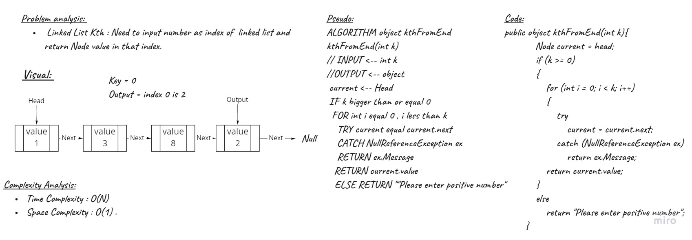

# Challenge Summary
<!-- Description of the challenge -->
- Implement common function for singly linked list :
    1. Linked List Kth : Need to input number as index of  linked list and return Node value in that index, From the end . 
## Whiteboard Process
<!-- Embedded whiteboard image -->
Linked List Kth (Finde node by index)


## Approach & Efficiency
<!-- What approach did you take? Why? What is the Big O space/time for this approach? -->
| Method    | Time Complexity |Space Complexity|
|-----------|-----------------|----------------|
| kthFromEnd| O(n)            | O(1)           |

## Solution
<!-- Show how to run your code, and examples of it in action -->
- kthFromEnd

```C#
public object kthFromEnd(int k)
        {
            Node current = head;
            if (k >= 0)
            {
                for (int i = 0; i < k; i++)
                {
                    try
                    {
                        current = current.next;
                    }
                    catch (NullReferenceException ex)
                    {
                        return ex.Message;
                    }
                }
                return current.value;
            }
            else
            {
                return "Please enter positive number";
            }
        }
```

## Test Linked List Kth

- [x] Test if k is greater than the length of the linked list
- [x] Test if k and the length of the list are the same
- [x] Test if k is not a positive integer
- [x] Test if the linked list is of a size 1inked list
- [x] Test if k is not at the end, but somewhere in the middle of the linked list

## Unit Tests

- Test if k is greater than the length of the linked list

```bash
def Test1():
    LinkedList list = new LinkedList(1);
    list.Insert(3);
    list.Insert(8);
    expected = 2;
    actual = 2;
    assert expected is actual, list.kthFromEnd(0)
```
- Test if k and the length of the list are the same

```bash
def Test2():
    LinkedList list = new LinkedList(1);
    list.Append(9);
    list.Append(10);
    expected = 1;
    actual = 1;
    assert expected is (actual, list.kthFromEnd(3))
```

- Test if k is not a positive integer

```bash
def Test3():
    Linked_List list = new Linked_List(8);
            list.Append(9);
            list.Append(10);
            expected = -1;
            actual = "Please enter positive number";
            assert expected is (actual, list.kthFromEnd(-1));
```
- Test if the linked list is of a size 1

```bash
def Test4():
     LinkedList list = new LinkedList(1);
            expected = 1
            actual = 1;
            assert expected is (actual,list.kthFromEnd(0));
```

- Test if k is not at the end, but somewhere in the middle of the linked list

```bash
def Test5():
      LinkedList list = new LinkedList(1);
            list.Insert(3);
            list.Insert(8);
            list.Insert(2);
            expected = 3;
            actual = 3;
            assert expected is (actual,list.kthFromEnd(2));
```