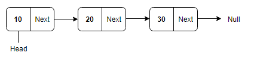

# Singly Linked List 

## Singly Linked List: 

- Singly linked lists contain nodes which have a data part and an address part, i.e., Next, which points to the next node in the sequence of nodes. The next pointer of the last node will point to null.



## How Creating a Singly Linked List

### Node Class

```C#
public class Node
    {
        public object value;
        public Node next;

        // contractor for initial value
        public Node(object value)
        {
            this.value = value;
            this.next = null;
        }
    }
```

- Value type is object to contain (Any type).
- Next is refrence for next node.
- Create contractor with node value and address of next node and is initialized to null.


### LinkedList Class

- Now, our node has been created, so, we will create a linked list class now. When a new Linked List is instantiated, it just has the head.

```C#
public class LinkedList
    {
        public Node head;
    }
```

- When Linked List first time head (first node) is null .

### LinkedList Class methods

#### Insert

- Accesc modifier : public
- Arguments: value
- Returns: nothing

```C#
public void Insert(object value)
        {
            Node newNode = new Node(value);
            newNode.next = head;
            head = newNode;
        }
```
1. Create new object from Node class and give it value you want to inserted.
2. Put newNode first index its have O(1) Time .
3. Make newNode is head .

#### includes

- Accesc modifier : public
- Arguments: value
- Returns: Boolean

```C#
 public bool Include(object value)
        {
            Node current = head;
            while (current != null)
            {
                if(value.Equals(current.value))
                {
                    return true;
                }
                current = current.next;
            }
            return false;
        }
```

1. Create current variable Node class type to hold the current node.
2. Looping over all nodes .
3. If current.value equale parameter then this Linke list include this value and return true.
    > note that here i use "Equals" becuse value type is object 
4. Finally get the next node 
5. If value not found return false.

### To String

- Accesc modifier : public
- Arguments: none
- Returns: String

```C#
public string Tostring()
        {
            string str = "";
            Node current = head;
            while (current != null)
            {
                str += $"[ {current.value} ] -> ";
                current = current.next;
            }
            str += "NULL";
            return str;
        }
```

- Method to print all node value as this formatted as:

```bash
"[ a ] -> [ b ] -> [ c ] -> NULL"
```


## Singly Linked Test

- [x] Test instantiate an empty linked list
- [x] Test for insert into the linked list
- [x] Test the head property will properly point to the first node in the linked list
- [x] Tset if can properly insert multiple nodes into the linked list
- [x] Test to return true when finding a value within the linked list that exists
- [x] Test to return false when searching for a value in the linked list that does not exist
- [x] Test to return a collection of all the values that exist in the linked list